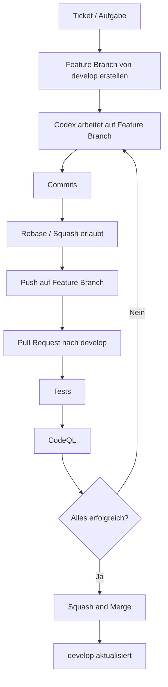

```mermaid

flowchart TD

    A[Ticket / Aufgabe] --> B[Feature Branch von develop erstellen]

    B --> C[Codex arbeitet auf Feature Branch]
    C --> D[Commits]
    D --> E[Rebase / Squash erlaubt]
    E --> F[Push auf Feature Branch]

    F --> G[Pull Request nach develop]

    G --> H[Tests]
    H --> I[CodeQL]
    I --> J{Alles erfolgreich?}

    J -- Nein --> C
    J -- Ja --> K[Squash and Merge]

    K --> L[develop aktualisiert]

```