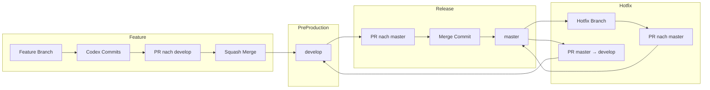

```mermaid

flowchart LR

    subgraph Feature
        A[Feature Branch]
        B[Codex Commits]
        C[PR nach develop]
        D[Squash Merge]
    end

    subgraph PreProduction
        E[develop]
    end

    subgraph Release
        F[PR nach master]
        G[Merge Commit]
        H[master]
    end

    subgraph Hotfix
        I[Hotfix Branch]
        J[PR nach master]
        K[PR master → develop]
    end

    A --> B --> C --> D --> E

    E --> F --> G --> H

    H --> I --> J --> H
    H --> K --> E

```