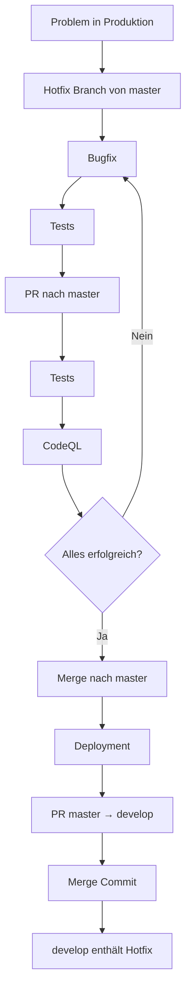

```mermaid

flowchart TD

    A[Problem in Produktion]
        --> B[Hotfix Branch von master]

    B --> C[Bugfix]
    C --> D[Tests]

    D --> E[PR nach master]

    E --> F[Tests]
    F --> G[CodeQL]

    G --> H{Alles erfolgreich?}

    H -- Nein --> C

    H -- Ja --> I[Merge nach master]

    I --> J[Deployment]

    J --> K[PR master → develop]

    K --> L[Merge Commit]

    L --> M[develop enthält Hotfix]
```