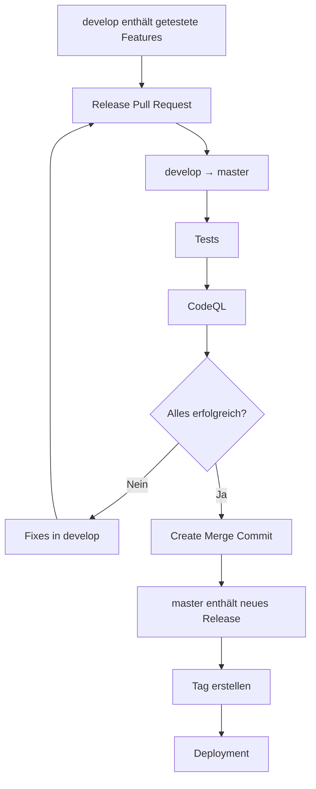

```mermaid

flowchart TD

    A[develop enthält getestete Features]
        --> B[Release Pull Request]

    B --> C[develop → master]

    C --> D[Tests]
    D --> E[CodeQL]

    E --> F{Alles erfolgreich?}

    F -- Nein --> G[Fixes in develop]
    G --> B

    F -- Ja --> H[Create Merge Commit]

    H --> I[master enthält neues Release]

    I --> J[Tag erstellen]
    J --> K[Deployment]

```